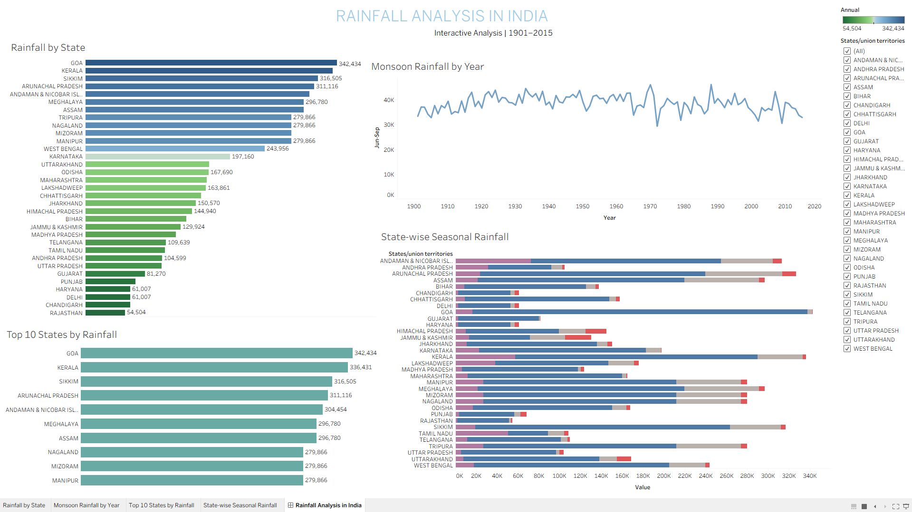

# Rainfall Analysis in India — Tableau Dashboard

## Overview

This project presents an interactive Tableau dashboard for analyzing rainfall patterns across India using historical rainfall data from **1901 to 2015**.

The dashboard provides insights into annual rainfall, monsoon rainfall trends, seasonal rainfall distribution, and the states with the highest rainfall.

## Dashboard

### Rainfall Analysis in India

The dashboard includes:

- Monsoon Rainfall by Year
- Rainfall by State
- State-wise Seasonal Rainfall
- Top 10 States by Rainfall
- State/Union Territory filtering for interactive analysis

## Key Analysis

### 1. Monsoon Rainfall by Year
Analyzes the variation in rainfall during the **June–September monsoon season** across different years.

### 2. Rainfall by State
Compares annual rainfall across Indian states and union territories.

### 3. State-wise Seasonal Rainfall
Provides a comparison of rainfall across four seasons:

- January–February
- March–May
- June–September
- October–December

### 4. Top 10 States by Rainfall
Identifies the states/union territories with the highest annual rainfall.

## Dataset

**Dataset:** Rainfall in India 1901–2015 (State-wise)

The dataset contains historical rainfall information for Indian states and union territories, including annual and seasonal rainfall measurements.

### Time Period
1901–2015

## Tools Used

- Tableau
- CSV Dataset
- Data Visualization
- Data Analysis

## Dashboard Preview



## Project Structure

```text
Rainfall-India-Analysis-Tableau/
│
├── README.md
├── Tableau/
│   └── Rainfall_India_Dashboard_analysis.twb
├── Dataset/
│   └── rainfall in india 1901-2015 (state-wise).csv
├── Screenshots/
│   └── Rainfall_India_Dashboard.png
└── Presentation/
    └── Rainfall_India_Dashboard.pptx
```

## What I Learned

- Creating interactive dashboards in Tableau
- Working with historical rainfall datasets
- Comparing rainfall across states and seasons
- Creating time-series visualizations
- Building Top 10 analysis
- Using filters for interactive dashboard analysis
- Presenting data through clear and meaningful visualizations

## Author

**Akhil Nasim N**

B.Sc. Computer Science | Data Analytics Enthusiast
